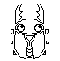
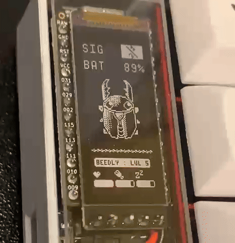

# nice!beetle Fork

This is a forked repo of mctechnology17's fantastic [zmk-nice-oled](https://github.com/mctechnology17/zmk-nice-oled) repo. Please give it a look and some love! None of this would be possible without me plagiarising his code.

This fork changes the gem animation of the nice!oled and nice!epaper to be a Tamagotchi widget of a beetle named Beedly. Why? Because I like beetles and the gem animation wasn't doing it for me.

This fork also provides a guide and (some) tools necessary to display your own images an animation.

See [TODO.md](TODO.md) for planned/future improvements.

# Changing the peripheral animation

The main bulk of code works by displaying CF indexed 1 bit files defined in `crystal.c` and played back using `animation.c`. 

This means, once we have an image, we can convert it, change the code and then display our image. You have a couple of options to do this.

## Change Animation with Aseprite and Make commands

Within `./sprite_assets/ase` are the `.ase` files for the regular and dithered Beedly animations. If you have [Aseprite](https://www.aseprite.org/), you can modify these and add frames as you please. 

Once you've changed the animation, you can generate the LVGL C arrays using `make beedly`, `make beedly_dithered` or `make beedly_all` depending on the animations you changed. This will create an Indexed CF 1-bit LVGL C-array for each frame in the `renders/beedly_...` folder. Copy everything under the eight palette elements at the top to the bottom. Also copy the `lv_img_dsc_t` object. Throw this over into the relevant frames in `crystal.c` 

Make sure to point your repo at this instead of the zmk-nice-oled repo in your `.conf` file and that should be all.

## Change Animation With Other Tools

You can do the same as the above section using any image you want and converting it using the [LVGL image converter](https://lvgl.io/tools/imageconverter). Select `LVGL v8` and `CF_INDEXED_1_BIT` colour format with C array output. 

Once you've got your files, copy the map data and override the frames in `crystal.c`. Same as the previous section. 

Make sure your main zmk `west.yaml` file points to this repo and the corresponding branch and you're good to go. 

# Future Improvements
See details in See the details in [TODO.md](TODO.md).

